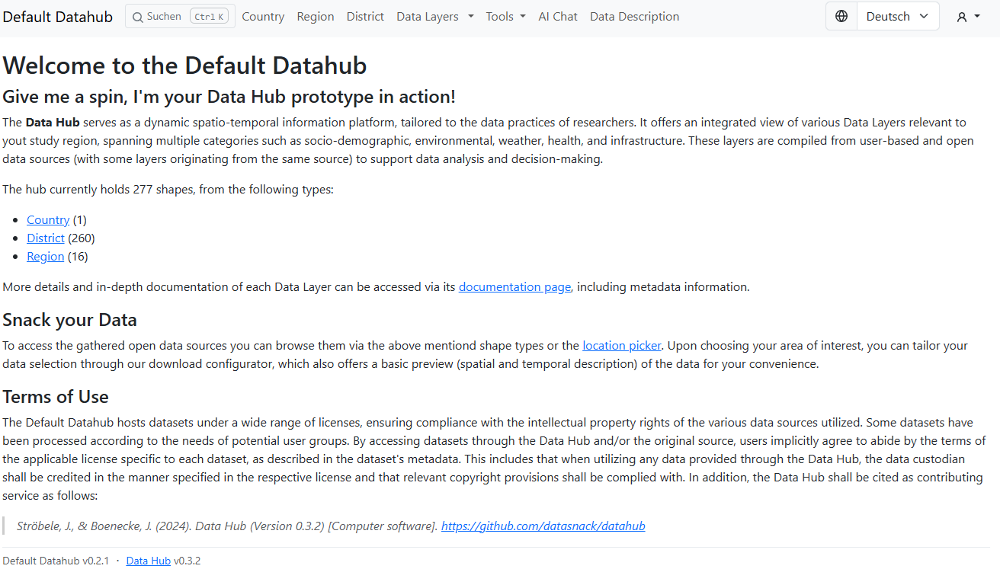
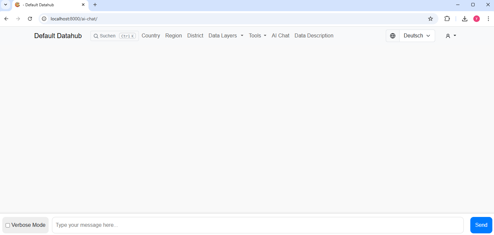
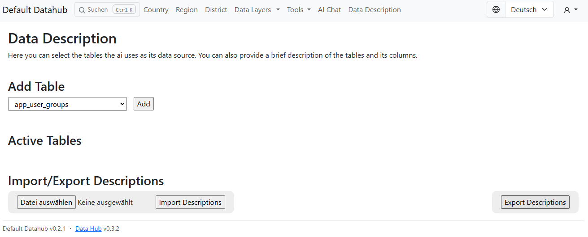
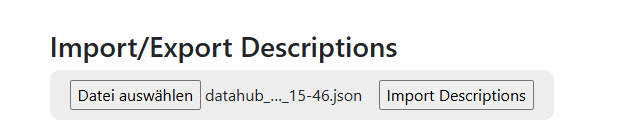
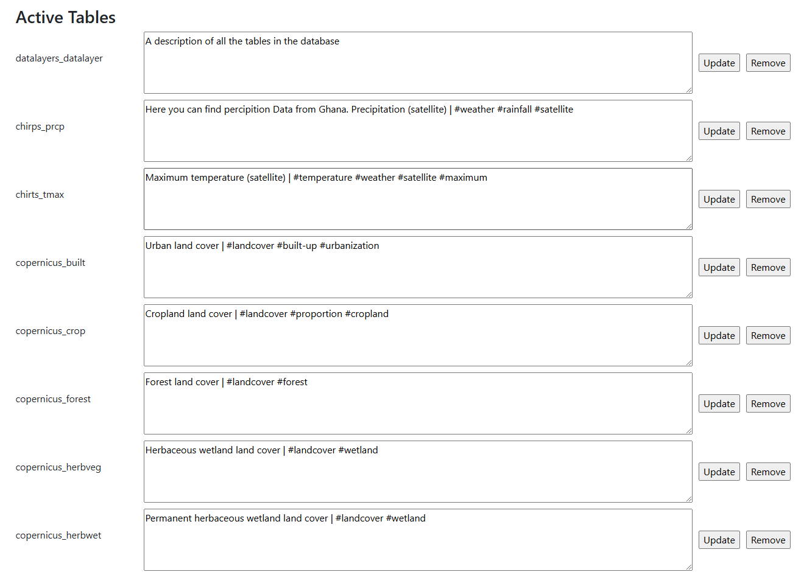

# Documentation

This is a combination of a [Data Hub](https://github.com/datasnack/datahub) instance and a Chat-Bot powered by an LLM for interaction.

The Data Hub is a geographic information system (GIS) featuring a data fusion engine designed for data harmonization, alongside an interactive dashboard for effective data exploration and collaboration. Its key objective is to merge data of multiple formats and sources across temporal and spatial axes, allowing users to combine, analyze, and interpret the data.

## Required Software

It is required to have Git, Docker, Python, an Environment Manager for Python (the documentation follows anaconda), Ollama for managing different models, and PostGIS for interfacing Datahub's provided Data

## Setup and Installation

In the following you will find the walkthrough for installing and running the dh-chatbot-llm project

### Cloning the Repository

-   Clone the repository `$ git clone https://github.com/yunussozeri/dh-chatbot-llm`
-   Copy the `.env.example` to `.env` using the following command: `$ cp .env.example .env`
-   Open the `.env` file and make sure the following variables are set `SECRET_KEY`, `DATAHUB_NAME` (instructions are inside the `.env` file)
-   Run `$ docker compose up -d`
-   Wait/check until [http://localhost:8000/](http://localhost:8000/) shows the chat interface

After this you can start/stop the system with:

    $ docker compose start
    $ docker compose stop

If you change the `.env` file run the following command to apply the changes:

    $ docker compose up -d

Now either import an existing data dump, or create a new instance. Steps for importing an existing dump is below.

If you get the error "Cannot connect to the Docker daemon at..." this means your Docker is not running, try starting Docker and running the command again.

### Preparing the Data-Dump

Datahub provides ready-to-use database export for Ghana that you can use to directly see and use the system without the need to download and process the raw data on your local machine.

Go to the [releases](https://github.com/datasnack/dh-ghana/releases) page and download the latest `*.dump` file and place it in the `./data/` folder.

Run the following command from the root of the repository:

    $ docker compose exec datahub python manage.py restore ./data/<downloaded *.dump file>

### [dev] Installing Ollama

Go to [Ollama Website](https://ollama.com/download) and download for your operating system.

After the installation is complete go to the

After that you can download and install the required model
with the following command: `$ docker compose exec ollama ollama pull dolphin-llama3:latest`

### [dev] Creating a Virtual Environment

This documentation uses Anaconda Distribution as Python Environment Manager. You can use any environment manager you like

For download go to [Anaconda Download Page](https://www.anaconda.com/download/success) and download for your operating system.

After the installation is complete, go to the repository location and open a terminal in the root directory.

Create a new virtual environment wit the following command : `conda create -n <name of your virtual environment> python=3.9.13`

After that you can activate the virtual environment with: `conda activate <name of your virtual environment>`,
And deactivate with : `conda deactivate <name of your virtual environment>`

### [dev] Creating a Django-Superuser

Run the following command to create a new user with which you can log in into the backend ([http://localhost:8000/admin](http://localhost:8000/)):

    $ docker compose exec datahub python manage.py createsuperuser

### Composing together the rest of the required Containers

After importing the data dump you are ready to build the container that will communicate with the language model.

To do this, run the following command in the root directory: `$ docker compose build`

You need an active internet connection for the build.

After the process is complete you can now use the AI Chat in the Datahub interface.

### Reaching the Interface

The interface is avaliable under [AI Chat](http://localhost:8000/ai-chat).

You can enter your prompt into the text box and send it to the AI and get information about the data.

#### Verbose Mode

Verbose Mode provides more detailed overview of what happens inside the AI after you send your request. Click on the check-box to enable this mode.

#### Active Tables

Currently, the AI depends on manually entered descriptions about the tables in the database. These are called active tables.

You can manage this by using this interface under [Data Description](http://localhost:8000/data-description/).

#### Updating Table Descriptions

You can either import prepared table descriptions or write them, better them yourself. To import and existing one click on [Choose File/Datei Auswählen]() and select the json-file:

After selecting the json-file, you will return to the page , now press on [Import Descriptions]()

This will load the descriptions into the database.

After that your data descriptions should look something like this :

### Implementing Local Changes and Adding other Extensions

## Architechture and Design

### Key Decisions

### Choosing a Large Language Model

We wanted a model that is free, smart enough to sustain our requirements but small enough so that it could run on many devices.

However, the performance of the model and interface cohesion varied drastically when we experimented with different models.

### Limitations

Missing Know-How about django Architechture made it sometimes hard to adapt the solutions to the surfaced problems. Although, in very few cases we were not able to find a workaround solution.

One option was to deploy the project on the kubernetes-cluster of University of Applied Sciences of Hamburg, which we are still working on.

## Contact and Feedback

The Chatbot Extension to datahub-ghana is made by students of University of Applied Sciences in Hamburg

-   Jan Biedasiek, jan.biedasiek@haw-hamburg.de
-   Michael German, michael.german@haw-hamburg.de
-   Yunus Sözeri, yunus.soezeri@haw-hamburg.de
-   Benedikt Weyer, benedikt.weyer@haw-hamburg.de

You can create Pull-Requests to our Repository or send an Email to one of us for Feedback!
